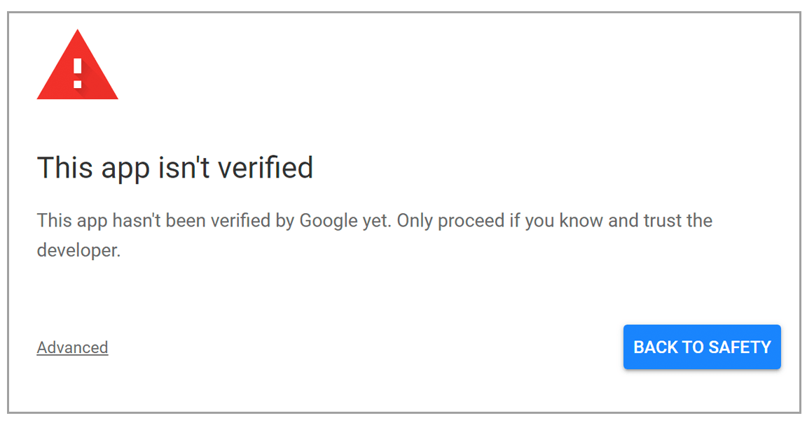

# OAuth - Google Client

This is a project done for Secure Software Development (SSD) module - 4th Year 2nd Semester, in order to demonstrate the workflow of OAuth 2.0 - Authorization Code grant type. Using the application, users could do the following tasks:
* :heavy_check_mark: Upload a file to their Google Drive 
* :heavy_check_mark: Create a sharable link
* :heavy_check_mark: Delete a file in Google Drive

<br/>


 
<br/>

 ## Installation
 ### *Prerequisites*
 In order to run the project, you need to have node installed in the device that you are running.
 
 ### How to install and run the application
 **Step 1: Clone the Repo**
```bash
    git clone https://github.com/MadhawaJayagoda/OAuth_Google_Client-yr4_sem2.git
```
<br/>

 **Step 2: Install dependencies and node modules** <br/>

Navigate to the root directory of the application and run the following command:
 ```bash
    npm install
```  
You'll see a progress bar as npm begins downloading the dependencies, and a `node_modules/` folder will be created in the project's root directory. A `package-lock.json` file will also be created, if none existed in the project already. 
<br/><br/>

 **Step 3: Run the Application** 
 <br/>
 
  Now that all the dependencies are installed, application could be run using the following command:
  ```Bash
    node app.js
```
Done!  &nbsp; Now you should be able to access the running application from any of your favourite browsers using the following link:
> [http://localhost:3000](http://localhost:3000)      
 
  <br/>
  
  > ⚠ **Note**: If you get the Warning message shown below that the app isn't verify, Please continue to the webpage by using the **Advanced** option below the message. 
>   
>{:height="700px" width="400px"}
  
  
  
  ## Screenshots of the Working application
  
   
   
  
  
  
  
  
  
  
